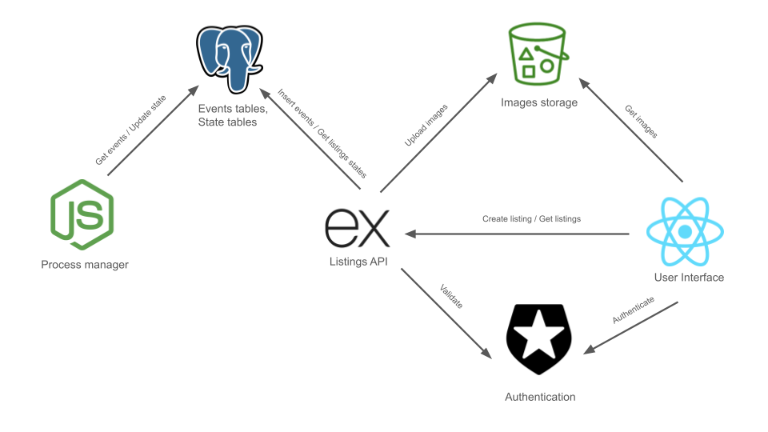
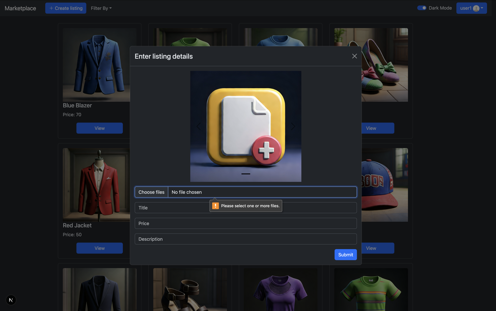
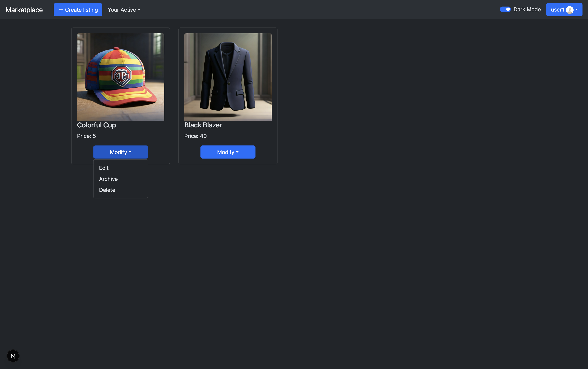
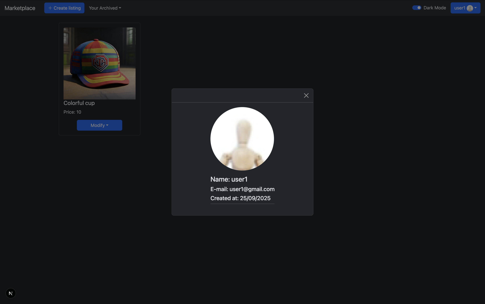

# Marketplace (in development)

## Abstract

The application is built using an Event Sourcing architecture pattern. User interaction is managed through a Graphical Interface developed with React and Bootstrap. Every user action initiates an call to the API implemented in Node.js generates corresponding events recorded in an event table within the PostgreSQL database. These events are processed by dedicated process managers that update the listing states. Images are stored on AWS S3 bucket. Access requires authentication, which is handled by Auth0, an external SaaS client.


## Services overview



## Description

In this document you will find a few sections.
Current section presents you overview about project. Next, you can find a Tutorial which explains how to use a app. Section Requirements list tools  necessary for installation. Then you will find a installation process.

## Technlogies

- Typescript - programming language
- ExpressJS - API application framework
- React - UI Framework
- Bootstrap - CSS framework
- Auth0 - authentication
- S3 Bucket - storage
- Postgres - database
- Docker Compose - runtime

## Tutorial

How to use this application? It is very simple. Main page looks like:


### Login

You can browse and view listings without logging in. However, logging in allows you to purchase items and create your own listings. Click the Login button, and you will be redirected to the Auth0 page, where you will need to create an account. After successful authentication, you will be redirected back to the Marketplace, where you should see a dashboard similar to the example below.

Notice that the Login to add listing button has been replaced by the _+ Create Listing_ button, and next to it, you will find a _Filter By_ dropdown. On the far right of the navigation bar, the Login button is replaced by your account nickname and profile photo.


### View and buy listing

On the main page, each listing shows only one photo along with the item’s name and price. To view more details, you can click the View button, which will open the full listing and display the description. If the listing contains multiple photos, a carousel will automatically rotate through them every few seconds.

When you want to purchase an item, simply press the Buy button and it will be added to your purchases. You can review all the items you have bought by setting the Filter By option to Your Purchases.


### Add your listing

You can add a new item by pressing the + Create Listing button. To complete the process, you must upload at least one photo, set a price, and provide both a title and a description for the listing. Validation ensures that a listing cannot be created without this information. Once your listing is added, it will appear on the main page alongside other listings. However, instead of displaying a View button like the others, your listings will feature a Modify button, allowing you to edit them at any time.


### Modify your listings

To view listings available for purchase, set the Filter By option to Your Active. You can modify the details of an existing listing by selecting Edit from the Listing Modify dropdown menu.

You can also Archive a listing, which makes it invisible to all users except you. This allows you the option to restore the listing at a later time. Alternatively, you may choose to Delete a listing permanently.


### Filter and switchin beetween dark and light mode

All available application filters are presented here, along with the option to activate the light theme.


### Account details

To view your account details, click the button featuring your nickname, which is located on the right side of the navigation bar.



## Requirements

- Docker
- Auth0 account
- AWS account

## Installation process

You need to do steps below to install this project.

### Install Docker

To install this project you have to need a have a Docker on your local machine and be able to perform _docker compose_ actions.

### Download project

If you have installed Github you can download a project from Github by executing command below. Otherwise, download and unpack a zip file from here [here](https://github.com/Bartosz95/marketplace/archive/refs/heads/main.zip)

```
git clone https://github.com/Bartosz95/marketplace.git
```

### Authentication account

In your Auth0 account, create two applications.
First, create a _Regular Web Application_. Fill in the required fields, and in the _Application URIs_ section, set http://localhost for:

- Allowed Callback URLs
- Allowed Logout URLs
- Allowed Web Origins

Next, create a second application of type _API_. Once created, navigate to the _Machine to Machine Applications_ tab and enable authorization for the previously created Regular Web Application.

### Configure environment variables

Configure 2 _.env_ files.

In `<project_dir>/api/` directory create a `.env` file with _AUTH_AUDIENCE_ and _AUTH_ISSUER_BASE_URL_ taken from Auth0 webside.

```
AUTH_AUDIENCE=<your api identifier>
AUTH_ISSUER_BASE_URL=https://<your Auth0 Domain URL>
```

Example:

```
AUTH_AUDIENCE=http://marketplace/api
AUTH_ISSUER_BASE_URL=https://dev-e857rf6yf68r.us.auth0.com/
```

In `<project_dir>/ui/` directory create a `.env` file with _AUTH_AUDIENCE_ and _AUTH_ISSUER_BASE_URL_ taken from Auth0 webside.

```
NEXT_PUBLIC_AUTH0_DOMAIN=<your Auth0 Domain URL>
NEXT_PUBLIC_AUTH0_CLIENT_ID=<your Client ID>
NEXT_PUBLIC_AUTH0_AUDIENCE=<your api identifier>
NEXT_PUBLIC_AUTH0_REDIRECT_URI=http://localhost/
NEXT_PUBLIC_API_URL=http://localhost:3001
NEXT_PUBLIC_IMAGES_URL=http://localhost:3002/images
```

Example:

```
NEXT_PUBLIC_API_URL=http://localhost:3001
NEXT_PUBLIC_IMAGES_URL=http://localhost:3002/images
NEXT_PUBLIC_AUTH0_DOMAIN=dev-e857rf6yf68r.us.auth0.com
NEXT_PUBLIC_AUTH0_CLIENT_ID=2352356264366346
NEXT_PUBLIC_AUTH0_AUDIENCE=http://marketplace/api
NEXT_PUBLIC_AUTH0_REDIRECT_URI=http://localhost:3000
```

### Build and run the project

In your main project directory run command below.

```
docker compose up --build -d
```

Open your browser on http://localhost.